# 🏥 Doctor Appointment Booking System

An efficient and user-friendly platform designed to streamline the process of booking doctor appointments, ensuring seamless communication between patients and healthcare providers. Built using React.js for the frontend and Node.js, Express.js, and MongoDB for the backend.

--- 
📝 **Overview** :
The Doctor Appointment Booking System enables users to filter doctor on the basis of specialization, book appointments, manage schedules, and receive notifications. The backend provides secure APIs for handling appointments, user authentication, and doctor management.


---

## 🚀 Live Demo

You can view the live version of this project here:  
[🩺 Doctor Appointment System - Live Demo](https://dochealth.onrender.com/)

API Documentation:  
[📄 Swagger API Docs](https://dochealth.onrender.com/api-docs/)

You can view the video demonstration of this project:  
[📽️ Video Demo](https://www.loom.com/share/c6e316e6fd3a4847970563b9f64987b8?sid=8668037d-5f7b-4349-823c-7c85c89bfcc2/)

You can view the Google Docs file, which includes a summary, useful links, etc.:  
[📃 Docs File](https://docs.google.com/document/d/1MdAel5LDzvxwVnKxwHLvfMzwSKfhb1GN/edit?usp=sharing&ouid=117885336231223452133&rtpof=true&sd=true)

---

## 📑 Table of Contents

1. [Overview](#-overview)
2. [Features](#-features)
3. [Technologies Used](#-technologies-used)
4. [Installation](#-installation)
5. [API Endpoints](#-api-endpoints)
6. [Usage](#-usage)
7. [Screenshots](#-screenshots)
8. [Challenges Faced](#-challenges-faced)
9. [Future Enhancements](#-future-enhancements)
10. [Acknowledgments](#-acknowledgments)

---

## 📝 Overview

This **doctor appointment appointment system** allows patients to book appointments with doctors, manage their profiles, submit feedback, and view their bookings. The **admin panel** APIs are ready but will be integrated in future updates.

---

## ✨ Features

- 🏥 **User Authentication** - Signup, Login, Logout.
- 📅 **Book Appointments** - Schedule doctor visits.
- 📋 **Manage Appointments** - View & update bookings.
- 📝 **User Profile** - View and update personal details.
- ⭐ **Feedback System** - Users can submit feedback.
- 🔒 **Protected Routes** - Secure access to dashboard and profile.
- 📱 **Fully Responsive UI** - Works across all devices.
- 🚀 **Admin APIs Completed** - Admins can manage doctors, users, and appointments.
- ⚖️ **E2E Testing & Unit Testing** - Ensuring system reliability.

- 📱 **Disabled Default Right click inspect option and zoom using mouse touchpad** - Ensuring App like feeling.

---

## 🛠️ Technologies Used

### **Frontend:**
- **React.js** - UI development.
- **Tailwind CSS** - Styling.
- **React Router Dom** - Navigation.
- **React Hot Toast** - Notifications.
- **Redux Toolkit** - State management.
- **Vitest and React Testing Library** -For Unit Testing

### **Backend:**
- **Node.js & Express.js** - Backend framework.
- **MongoDB** - Database.
- **Mongoose** - ODM for MongoDB.
- **CORS** - Handling cross-origin requests.
- **dotenv** - Environment variables.
- **JWT Authentication** - Secure user sessions.
- **Cloudinary** - Image upload.
- **Swagger** - API Documentation.
- **Chalk** - Pretty console logs.

---


## ⚙️ Installation  

### **Frontend Setup**  

1. **Clone the repository**  
   ```bash
   git clone https://github.com/AnandIsCoding/Doctor-Appointment-Booking-System
   
2. Navigate to the client directory:
   ```bash
   cd client
1. Install dependencies::
   ```bash
   npm install   
2. Start the development server:
   ```bash
   npm run dev
3. Open your browser and navigate to:
   ```bash
   http://localhost:5173
---
### **Backend Setup**  

1. **Navigate to the server directory**  
   ```bash
    cd server

2. Install dependencies:
   ```bash
   npm install   
3. Create a .env file in the root and add the following variables
   ```bash
   NODE_ENV=development
   PORT=8000
   MONGO_URI=mongodb://127.0.0.1:27017/Doctor-Appoint-System


4. Start the backend server
   ```bash
   npm run dev

4. The API will be running at
   ```bash
   http://localhost:3000 
---


## 📌 API Endpoints

### **User Endpoints**

| Method | Endpoint | Description |
|--------|----------|-------------|
| POST | `/api/v1/user/signup` | User registration |
| POST | `/api/v1/user/login` | User login |
| GET | `/api/v1/user/profile/view` | View user profile |
| PUT | `/api/v1/user/profile/update` | Update profile |
| GET | `/api/v1/user/logout` | Logout user |

### **Appointment Endpoints**

| Method | Endpoint | Description |
|--------|----------|-------------|
| POST | `/api/v1/appointment/book-appointment` | Book an appointment |
| GET | `/api/v1/appointment/my-appointments` | View all user appointments |

### **Doctor Endpoints**

| Method | Endpoint | Description |
|--------|----------|-------------|
| GET | `/api/v1/doctor/alldoctors` | Get all doctors |
| GET | `/api/v1/doctor/{id}` | Get doctor details |

### **Feedback Endpoints**

| Method | Endpoint | Description |
|--------|----------|-------------|
| POST | `/api/v1/feedback/new` | Submit feedback |

### **Admin Endpoints**  

| Method | Endpoint | Description |  
|--------|------------------------------|--------------------------|  
| POST   | `/api/v1/admin/login`         | Admin login              |  
| POST   | `/api/v1/admin/register-doctor` | Register a new doctor  |  
| POST   | `/api/v1/admin/register-new-service` | Register a new service |  
| GET    | `/api/v1/admin/allservices`   | Get all services        |  


---

## 📌 State Management using Redux

This project utilizes **Redux Toolkit** for state management, ensuring efficient and scalable data handling. Below are the key aspects of Redux implementation:

- **Store Configuration**: The Redux store is set up using `@reduxjs/toolkit`, ensuring easy state management.
- **Slices**: Features such as authentication, user data, and appointments are managed using Redux slices.
- **React-Redux Hooks**:
  - `useSelector` for accessing state.
  - `useDispatch` for dispatching actions.
- **Persistence**: The Redux store maintains authentication states and user sessions.

This setup enhances performance and ensures seamless data flow across the application.

---


## 🖥️ Screenshots

### Home Page  
<p align="center">
  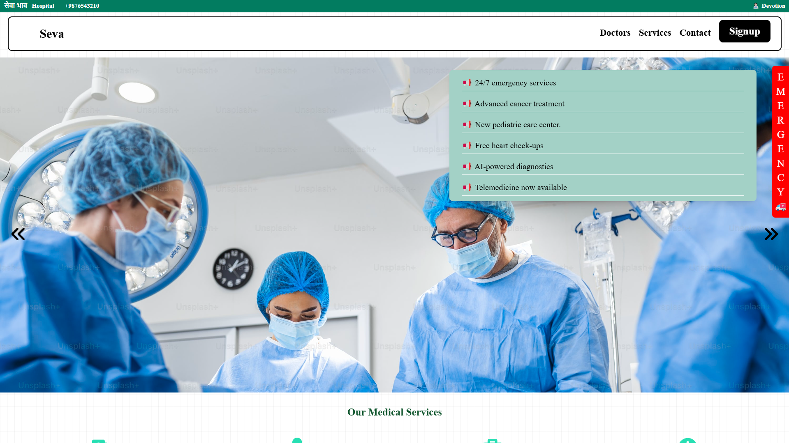
  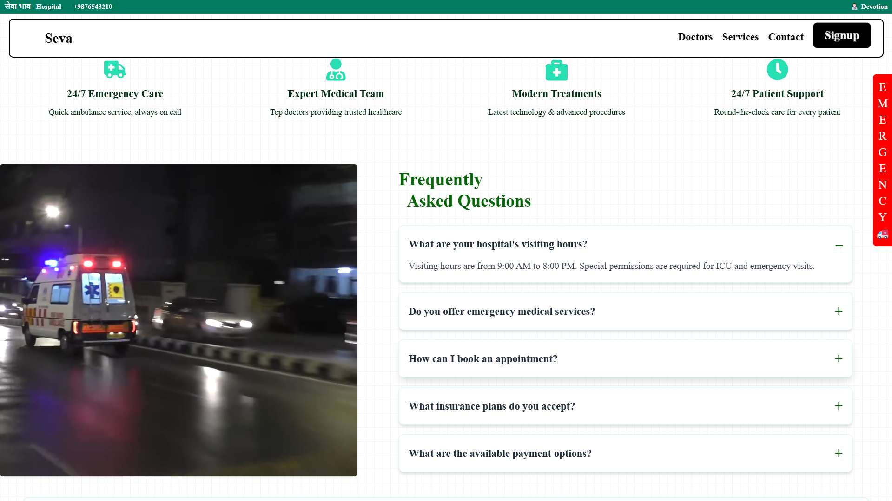
  <br><br> 
  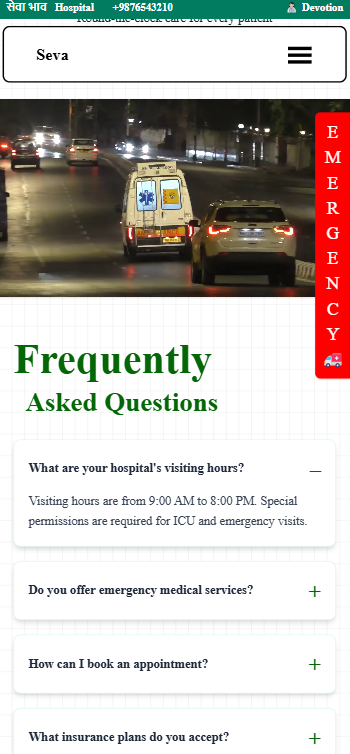
  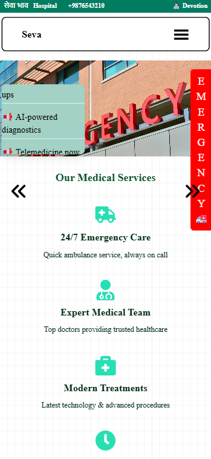
</p>


### Dashboard  
<p align="center">
  
  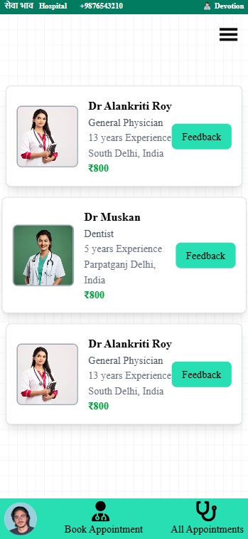

  <br>
  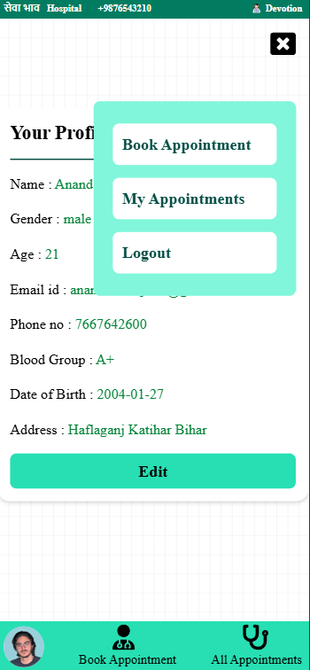
  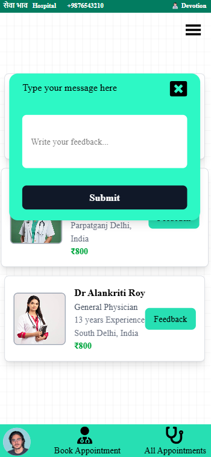

  <br>
  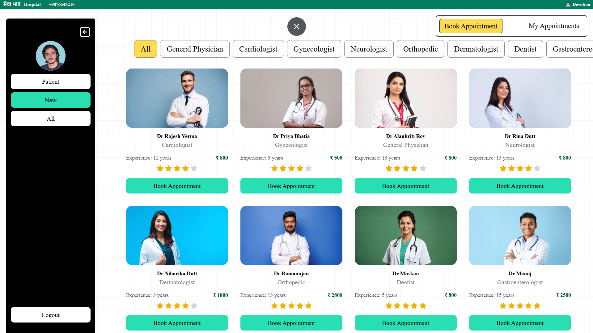
  <br> <br>
  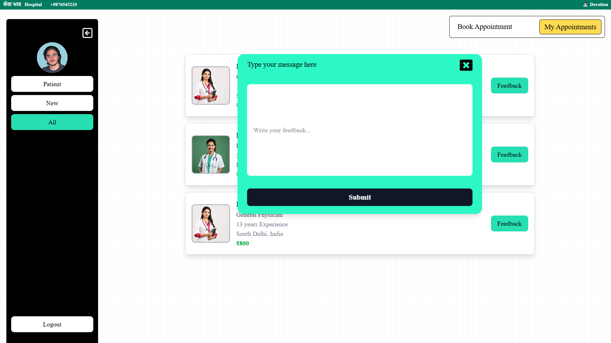
</p>


### Appointment Booking  
<p align="center">
    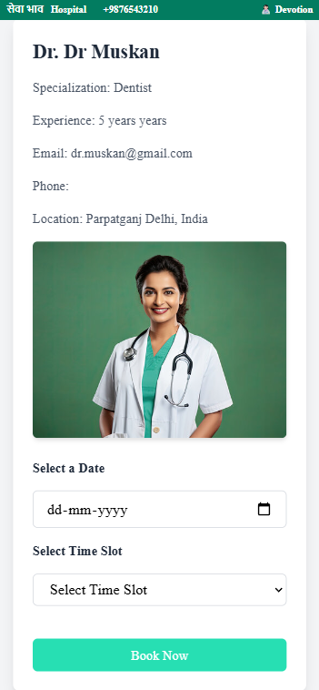
    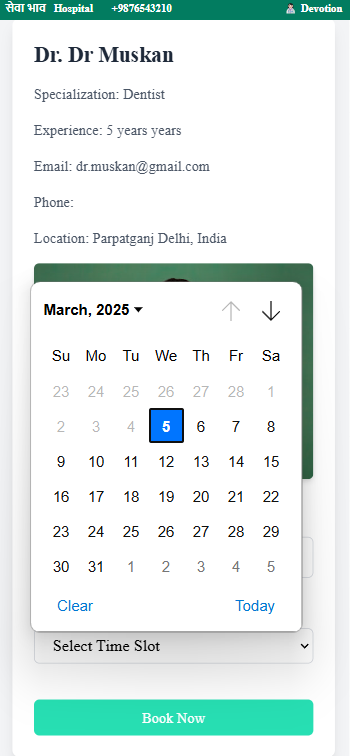
</p>

---

## 🚀 Challenges Faced

- **State Management** - Managing UI and API data efficiently.
- **Backend Integration** - Securely handling authentication.
- **Admin Panel Development** - APIs are ready; UI integration is in progress.

---

## 🔮 Future Enhancements

- 🎨 **Admin Panel UI** - Complete UI for managing doctors and appointments.
- 🔐 **Role-Based Access** - Different permissions for users and admins.
- 📧 **Email & SMS Reminders** - Notify users about their upcoming appointments.
- 📊 **Advanced Analytics** - Insights for doctors and admin.
- 📊 **Own Real-Time video call service using Socket.io** - Insights for doctors and admin.

---

## 🙌 Acknowledgments

- Special thanks to **AlmaBetter** for the learning opportunity.
- Inspired by various medical appointment systems.

---

## 👤 Author

**Anand Jha 🌿🫰**

